# git 介紹

git 有以下四大類型物件：

1. `Blob(Binary large object)`
2. `Tree`
3. `Commit`
4. `Tag`

### Blob

每當`git add`檔案的時候，就會產生一個 `blob object` ，`blob object`只會紀錄檔案的內容，不會紀錄檔名和其他資訊。

每個 `blob object` 都是由文件內容的 SHA-1 hash值來辨識，確保文件內容的唯一性。

由於`blob object`只會紀錄檔案的內容，因此，即使兩個文件位於不同目錄或使用不同的檔名，只要內容相同，Git 都會使用相同的 `blob object` 來記錄它們的內容。

<details>
<summary> <code>簡易實驗</code></summary>

#### 建立 `blob object`

```bash
# 新增一個資料夾並初始化repo
mkdir git-test
cd git-test
git init
tree .git/object # 結果如下
```

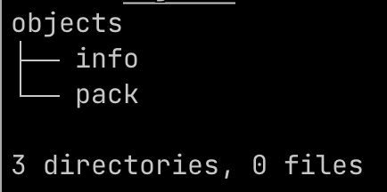

```bash
vim main.py # 寫入一行 print('hello, world')
git add main.py
tree .git/object # 結果如下，可以看到多了一個資料夾
```

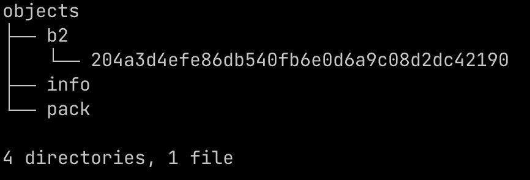

#### 查看 `blob object` 內容

```bash
git cat-file -t b2204a # git cat-file -t <sha-1 value>
git cat-file -p b2204a # git cat-file -p <sha-1 value>
```

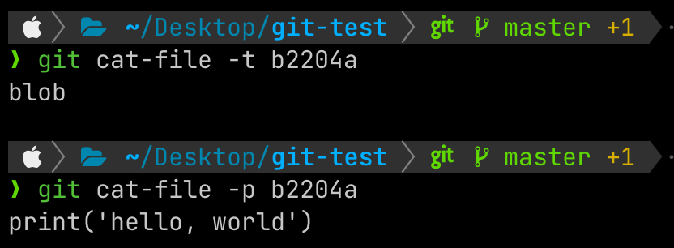

#### 建立相同內容的文件

```bash
vim main_exp.py # 同樣寫入一行 print('hello, world')
git add main_exp.py
tree .git/object # 結果如下，並沒有多出新的東西
```


由此可知，即使兩個文件位於不同目錄或使用不同的檔名，只要內容相同，Git 都會使用相同的 `blob object` 來記錄它們的內容。

</details>
<details>

<summary> <code>參考資料</code></summary>

<https://medium.com/@flyotlin/%E4%BB%80%E9%BA%BC%E6%98%AFgit%E7%89%A9%E4%BB%B6-ebbeb3b22f9c>
<https://titangene.github.io/article/git--blob-object.html>

</details>

### Tree

前面提到 `blob object` 不會記錄檔名，目錄名稱和檔案名稱就是由 `tree object`來管理。一個 `tree object`可以紀錄包含哪些 `blob object` (也就是檔案內容)，以及該 `blob object`對應的檔案名稱，以及其他 `tree object`和其對應的目錄名稱。

<details>
<summary> <code>簡易實驗</code></summary>

#### 將前面 git add 的檔案提交

```bash
# in /git-test
git commit -m "init commit"
tree .git/objects
```

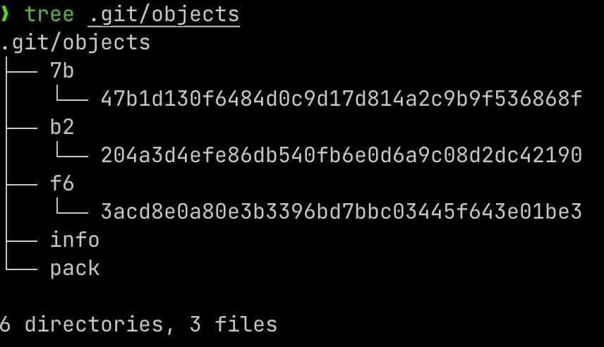

#### 查看 `tree object` 內容

```bash
git cat-file -t f63acd # git cat-file -t <sha-1 value>
git cat-file -p f63acd # git cat-file -p <sha-1 value>
```

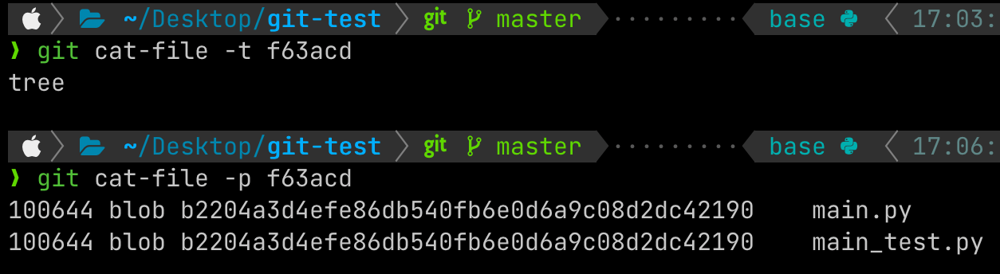

由此可見，一個 `tree object`可以紀錄包含哪些 `blob object` (也就是檔案內容)，以及該 `blob object`對應的檔案名稱

</details>
<details>

<summary> <code>參考資料</code></summary>

<https://medium.com/@flyotlin/%E4%BB%80%E9%BA%BC%E6%98%AFgit%E7%89%A9%E4%BB%B6-ebbeb3b22f9c>
<https://titangene.github.io/article/git-tree-object.html>

</details>

### Commit

`commit object` 代表一次提交，記錄了當前`repo`的狀態。每次提交代碼時，Git會創建一個 `commit object` ，紀錄了有關每次commit需要的資訊，如：提交者、提交時間、提交訊息(commit message)，以及指向前一個提交的指標。

<details>
<summary> <code>簡易實驗</code></summary>

#### 查看 `commit object` 內容

前面介紹tree的部分，commit 之後查看`tree .git/objects` 時，有一個資料夾還沒看過內容

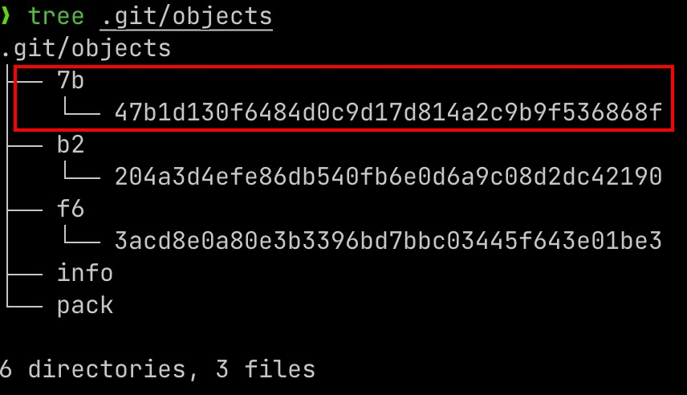

```bash
git cat-file -t 7b47b1 # git cat-file -t <sha-1 value>
git cat-file -p 7b47b1 # git cat-file -p <sha-1 value>
```

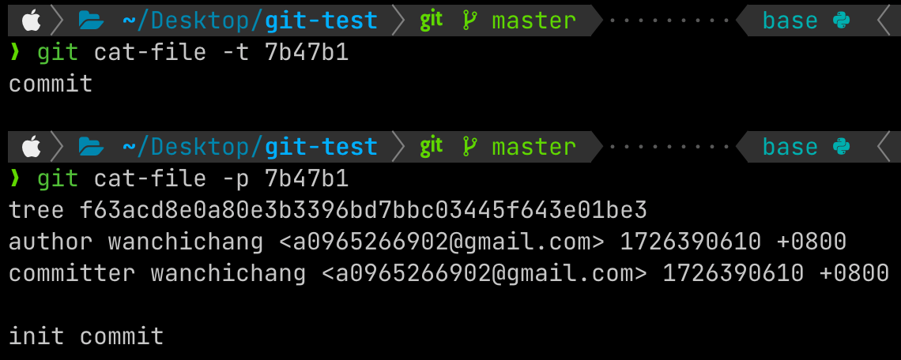

這邊就可以看到，建立一個commit之後，Git確實有建立`commit object`，以及這個object裡面的內容。

</details>

<details>
<summary> <code>commit message style</code></summary>
<br />
commit message的完整格式如下：

```
type: subject

body

footer
```

#### Type

- **feat**: a new feature
- **fix**: a bug fix
- **docs**: changes to documentation
- **style**: formatting, missing semi colons, etc; no code change
- **refactor**: refactoring production code
- **test**: adding tests, refactoring test; no production code change
- **chore**: updating build tasks, package manager configs, etc; no production code change

#### Subject

Subjects should be no greater than 50 characters, should begin with a capital letter and do not end with a period.

Use an imperative tone to describe what a commit does, rather than what it did. For example, use change; not changed or changes.

#### Body

Not all commits are complex enough to warrant a body, therefore it is optional and only used when a commit requires a bit of explanation and context. Use the body to explain the what and why of a commit, not the how.

When writing a body, the blank line between the title and the body is required and you should limit the length of each line to no more than 72 characters.

#### Footer

The footer is optional and is used to reference issue tracker IDs.

</details>
<details>

<summary> <code>參考資料</code></summary>

<https://medium.com/@flyotlin/%E4%BB%80%E9%BA%BC%E6%98%AFgit%E7%89%A9%E4%BB%B6-ebbeb3b22f9c>

<https://github.com/android/architecture-samples/issues/300>

<https://git-scm.com/book/zh-tw/v2/%E4%BD%BF%E7%94%A8-Git-%E5%88%86%E6%94%AF-%E7%B0%A1%E8%BF%B0%E5%88%86%E6%94%AF>

</details>

### Tag

在 Git 中，`tag` 是一種用來標記特定提交的指針，通常用於標記重要的節點，如版本發佈點（例如 `v1.0`）。`tag` 可以幫助我們方便地找到特定的提交。

Git 支援`lightweight tag`和`annotated tag`。

<details>

<summary> <code>參考資料</code></summary>

<https://medium.com/@flyotlin/%E4%BB%80%E9%BA%BC%E6%98%AFgit%E7%89%A9%E4%BB%B6-ebbeb3b22f9c>

</details>
<br />

---

### Branch、Head

使用分支（`Branch`）意味著我們可以從開發主線上分離開來，然後在不影響主線的情況下繼續工作。

`HEAD` 是一個指標，指向某一個分支，通常你可以把 `HEAD` 當做「目前所在分支」看待。在 `.git` 目錄裡有一個檔名為 `HEAD` 的檔案，就是記錄著 HEAD 的內容，

<details>
<summary> <code>簡易實驗</code></summary>

#### 查看當前`Branch`、`HEAD`

```bash
cat .git/HEAD
cat .git/refs/heads/master
```

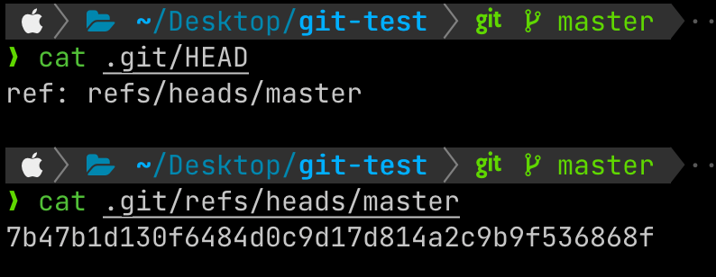

由此可見，所謂的分支其實就是一個紀錄**某個 Commit 的 SHA-1 值**的檔案（只有 40 個字元），因此我們可以靈活地在Git上對分支進行操作（建立新分支、切換或合併分支）。

#### 切換`Branch`

```bash
git branch exp # 建立新分支
git switch exp # 切換到新分支
cat .git/HEAD
cat .git/refs/heads/exp
```

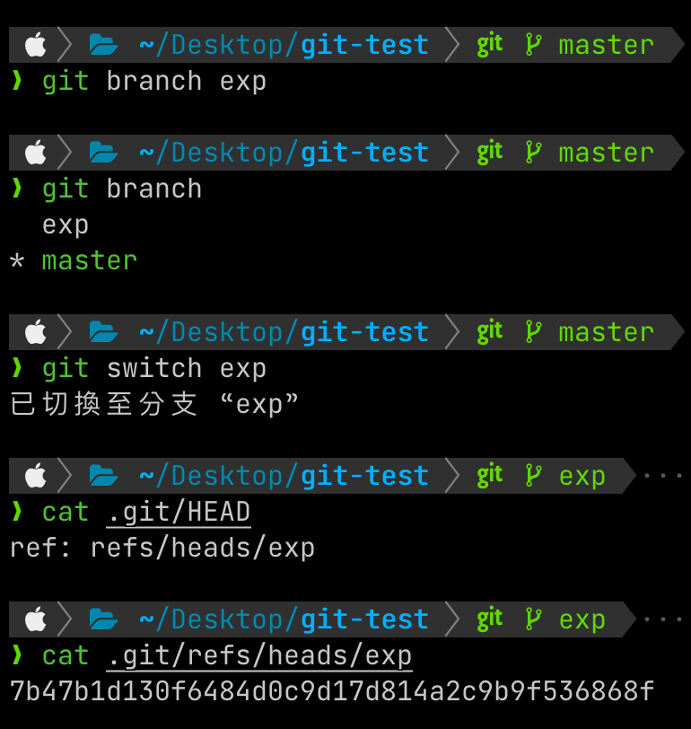

可以看到`HEAD`的指向改變了，由於我們尚未在`exp`這個分支上建立新的commit，因此可以發現`cat .git/refs/heads/exp`和`cat .git/refs/heads/master`印出的是同一個commit的SHA-1值。

#### 在新的`Branch`上建立commit

```bash
git add .
git commit -m "test"
cat .git/refs/heads/exp
git log --oneline
```

接著在exp這個分支上，修改任一檔案並建立commit（如下圖），可以看到`cat .git/refs/heads/exp`的值改變了，HEAD指向我們新建立的commit

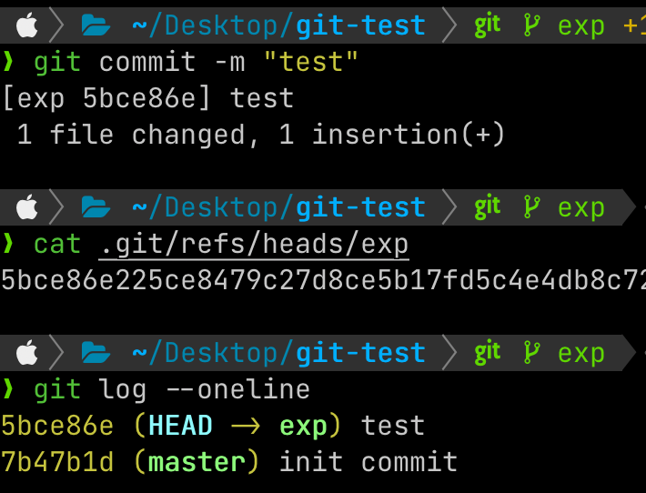

#### detached HEAD

前面提到 `HEAD` 通常會指向當前分支，而當前分支通常會指向該分支頂端的 commit (也就是該分支最新的 commit)。不過在某些情況下，會發生 HEAD 不是指向分支，而是指向某個 commit，而這個狀態的 `HEAD` 就被稱為`detached HEAD`。

例如，若使用 `git checkout` 跳至某個過去的 commit， Git 則會提醒你正在`detached HEAD` 狀態。

```bash
# on master branch
git commit -m "test detached HEAD"
git log --oneline
git checkout 7b47b1d # 跳回過去某個commit
```

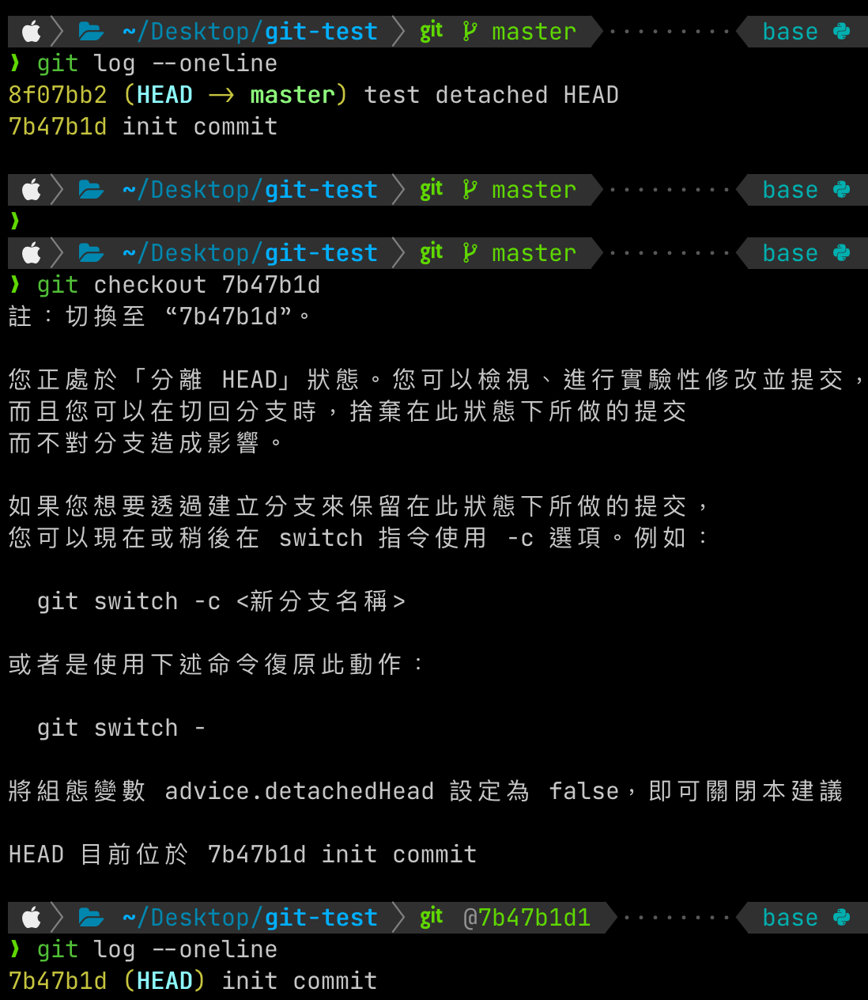

可以看到現在HEAD指向的是7b47b1d這個commit，而非指向一個分支。

若想要離開 `detached HEAD` 狀態，只需要讓HEAD再次指向分支，例如：`git switch master`。

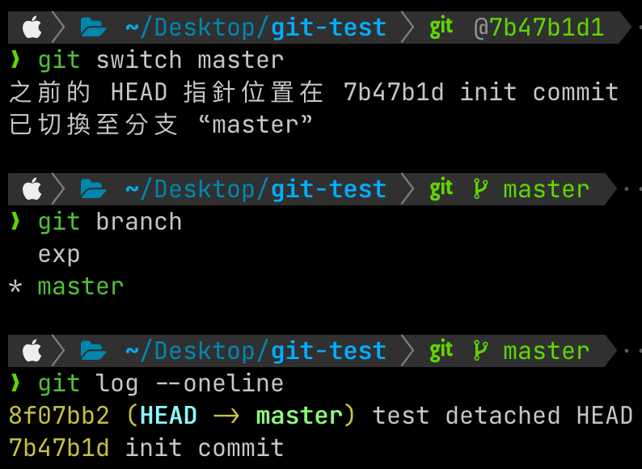

</details>
<details>
<summary> <code>參考資料</code></summary>

<https://gitbook.tw/>

<https://git-scm.com/book/zh-tw/v2/%E4%BD%BF%E7%94%A8-Git-%E5%88%86%E6%94%AF-%E7%B0%A1%E8%BF%B0%E5%88%86%E6%94%AF>

<https://titangene.github.io/article/git-detached-head.html>

</details>
