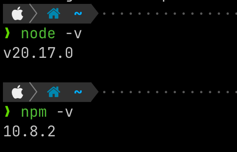

### 安裝的nodejs版本

我們組員的nodejs版本恰好均為`v20.xxx.xxx`，至[nodejs 官網](<https://nodejs.org/en/download/package-manager>)查看後發現`v.20.17.0`為LTS(Long-Term Support)，因此我們就決定選用`v.20.17.0`這個版本。



### nvm & npm 
#### nvm
`nvm` (node version manager)是 Node.js 的版本管理工具，讓使用者能在同一系統環境上輕鬆切換不同版本的 Node.js。

官網：<https://github.com/nvm-sh/nvm>

###### 常用指令
``` bash
nvm -v	#查看 nvm 版本，同 nvm –version
nvm ls	#列出已安裝版本，同 nvm list。
nvm ls available	#列出可以安裝的所有 node.js 版本，同 nvm list available。
nvm use <版本號>	#指定目前使用的 node.js 版本
nvm install <版本號>	#安裝指定版本的 node.js
nvm alias default <版本號>	#預設使用 node.js 版本
```


#### npm 
`npm` (Node Package Manager)是 Node.js 的套件管理工具。

建立`npm`專案時，會產生一個`package.json`來紀錄安裝套件的資訊。

用`npm`安裝的套件會存在`node_modules`這個資料夾。
上傳專案時，`node_modules` 不需要一併上傳，其他使用者可透過`package.json`自行安裝相關套件。
###### 常用指令
``` bash
npm init # 初始化一個新的 package.json
npm install <package> # 在當前目錄/專案安裝套件
npm install <package> -g # 參數 -g 表示全域安裝，而非僅限於當前專案
npm uninstall <package> 
npm update <package>
npm list # 列出已安裝套件
```


#### 參考資料：
<https://a0910288060.medium.com/%E4%BA%86%E8%A7%A3node-js-nvm-npm%E5%B7%AE%E5%88%A5-47cda7c1d569>
<https://seanacnet.com/node-js/nvm/>

<https://seanacnet.com/npm/npm-common-commands/>