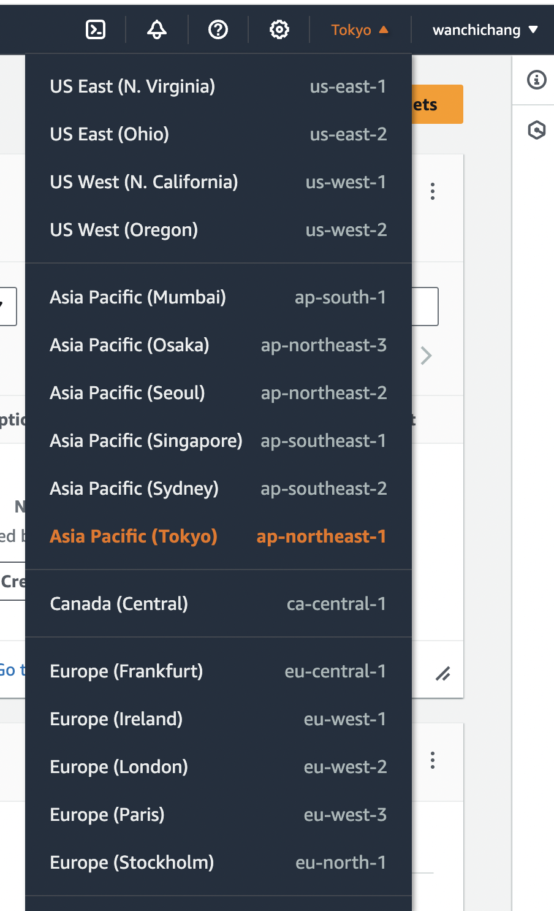

#### check list
- [x] AWS
- [x] callback.js
- [ ] promise.js（進階）
- [x] 建立 Express 專案
- [ ] localhost, curl(進階)
- [x] 分組

### AWS Region

Region 是一個地理位置， AWS 在世界各地設置了多個 Region ，而每個 Region 包含數個 AZ (availability zones)。

每個 Region 內的多個資料中心會獨立運行，且 AWS 不會跨越不同的 Region 自動複製資料，代表在不同的 Region 之間，資源和資料彼此獨立，便可達到高容錯能力與穩定性。

可以在AWS console查看可選的 Region有哪些

### AZ (availability zones) 
每個 Region 包含了數個 AZ (availability zones)。

AZ是 AWS 資料中心的集合，它們通常分佈在同一 Region 內的不同位置，但之間相互獨立，並且有自己的電源、冷卻和網路。AZ的目的是實現高可用性和容錯容忍性。如果一個可用區發生故障，其他可用區仍然可以繼續運行。

### 如何選擇用哪個 Region
1. **地理位置**：可選擇離使用者最近的 Region ，降低網路延遲
2. **成本**：不同的 Region 之間，AWS 服務的定價可能有所不同。選擇便宜的 Region 可以節省成本。
3. **法規合規性**：AWS 遵守各種全球性的法規和合規性標準，這讓使用者可以根據其需求選擇特定 Region 以滿足法規要求。
4. **多 Region 部署**：除了選擇單一 Region ，全球性的應用程式也可以利用多 Region 部署來提高可用性和可靠性，確保應用程式在單一區域發生故障時能夠繼續運行。

參考資料：
[https://docs.aws.amazon.com/zh_tw/AWSEC2/latest/UserGuide/using-regions-availability-zones.html](https://docs.aws.amazon.com/zh_tw/AWSEC2/latest/UserGuide/using-regions-availability-zones.html)
[https://ithelp.ithome.com.tw/m/articles/10315419](https://ithelp.ithome.com.tw/m/articles/10315419)
[https://ithelp.ithome.com.tw/m/articles/10192075](https://ithelp.ithome.com.tw/m/articles/10192075)
