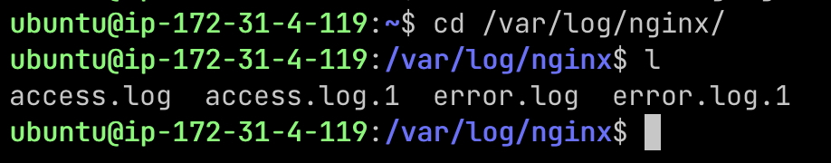

### week-04
#### Instance 的 public IP
[http://52.192.141.39](http://52.192.141.39)
#### Instance Type
`Instance type` 指的是雲端服務供應商（如 AWS、Google Cloud …）所提供的虛擬機的配置選項。`Instance type` 由不同的 CPU、記憶體、儲存體和聯網容量組合而成，讓我們能為應用程式彈性選擇適當的資源組合，根據需求選擇適合的 instance type。

例如：在 AWS，`t2.micro` 是一個常見的低配 `Instance type`。
#### Nginx
Nginx 是一個非同步框架的網頁伺服器，主要有以下用途：
- Web 伺服器：可以直接作為靜態內容的 Web 伺服器。
- 反向代理：作為中介層，將 client 的 request 轉發到後端的 server（如 Node.js、PHP 或 Python）。
- 負載均衡：分配流量到多個後端伺服器，以確保穩定性和提升處理性能。
#### pm2 
`pm2` 的 pm 指的是 Process Manager。`pm2` 是一個管理 Node.js 應用程式的工具，適合用在 production 環境中。

我們把服務部署到主機後， `pm2` 可以設定服務要不要自動重啟、要不要在存檔時自動重啟、開機自動啟動、管理 log 檔…等用途，來幫助我們管理服務。

#### proxy 是什麼意思？為何要透過 Nginx 來 proxy 到 Express 開發的 Web Server?
Proxy就是 client 跟 server 之間的一個中間層，幫助轉發 request 和回應。

當我們用 Nginx 來 proxy 到 Express Web Server 時，指的是 Nginx 充當一個 Reverse proxy ，接收外部 client 的 request ，並將這些 request 轉發給後端的 Express 伺服器來處理。

##### Reverse proxy（反向代理）
代表 server 接收 client 的 request 。

可隱藏 server IP：反向代理將 client 的 request 轉發到內部 server，客戶端只知道代理的 IP。

這樣可以將 request 分散到多台後端 server ，避免單一伺服器負載過重。也可以攔截和過濾惡意請求，保護內部 server，提高安全性。

##### Forward Proxy（正向代理） 
代表 client 發送 request ， server 只看得到 proxy 的 IP。
可以隱藏 client IP，用來繞過某些限制，VPN 就是一個典型的應用。
#### Nginx 設定檔
```nginx
server {
        listen 80 default_server;
        listen [::]:80 default_server;
        root /var/www/html;
        index index.html index.htm index.nginx-debian.html;

        server_name 52.192.141.39;

        location / {
                
                try_files $uri $uri/ =404;
                proxy_pass http://localhost:3000;
                proxy_set_header Host $host;
                proxy_set_header X-Real-IP $remote_addr;
                proxy_set_header X-Forwarded-For $proxy_add_x_forwarded_for;
                proxy_set_header X-Forwarded-Proto $scheme;
        }
}

```
#### Security Group
`Security Group` 是雲端服務（如：AWS）中的虛擬防火牆，可以允許或拒絕特定 IP 或 port 的連線。設定原則遵循最小權限原則，只開放必需的 port 和 IP，避免不必要的流量進入伺服器，以提高安全性。
#### sudo
`sudo` 是 "Super User DO" 的縮寫，代表這個指令是透過 Super User 所執行的。

一台電腦可能有很多不同的 user ，一般來說，我們不想要每個 user 都有權限更改電腦的所有設定。但如果有一個沒有權限的 user 需要做這樣的操作，就可以加上 `sudo` 來授予當前指令更高的權限。

##### 何時要加 sudo?  
進行一些系統層級的操作時需要加上 `sudo` ，例如：安裝或更新package、修改系統文件、啟動或停止系統服務等。
> [!CAUTION]
> 濫用 `sudo` 可能造成安全隱憂。Super user 擁有修改系統和刪除關鍵文件的權限，所以不應該隨便用 `sudo` 執行不必要的命令，避免意外損壞系統。
##### 何時不用加 sudo？
執行一些不需要修改系統或不影響其他 user 的操作時，不需加上 `sudo`，例如：在自己的目錄中新增、刪除文件、運行普通程式、安裝專屬於當前 user 的工具。

#### Nginx Log 檔
Nginx Log 檔位於 `/var/log/nginx/`，包含 Access Log (`access.log`) 和 Error Log(`error.log`) 。
##### 如何查看
```bash
sudo less /var/log/nginx/access.log 
sudo less /var/log/nginx/error.log 
```
##### 如何找到的?
參考下列資料：

[https://blog.csdn.net/oMcLin/article/details/110424347](https://blog.csdn.net/oMcLin/article/details/110424347)、ChatGPT

#### 其他問題

查看 Nginx 的 log 檔時，發現 `/var/log/nginx/` 目錄下除了 `access.log` 和 `error.log`，還有 `access.log.1` 和 `error.log.1` 這兩個檔案，詳細原因我還沒去研究。



#### 參考資料
Instance types: [https://aws.amazon.com/tw/ec2/instance-types/](https://aws.amazon.com/tw/ec2/instance-types/)

nginx: [https://www.explainthis.io/zh-hant/swe/why-nginx](https://www.explainthis.io/zh-hant/swe/why-nginx)

pm2: [https://ithelp.ithome.com.tw/articles/10220480](https://ithelp.ithome.com.tw/articles/10220480)

Security Group: [https://ithelp.ithome.com.tw/articles/10237747](https://ithelp.ithome.com.tw/articles/10237747)

sudo:
[https://yhtechnote.com/linux-sudo/](https://yhtechnote.com/linux-sudo/)

#### 過程 (optional)