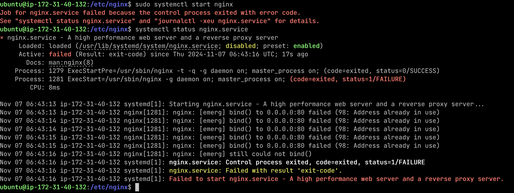
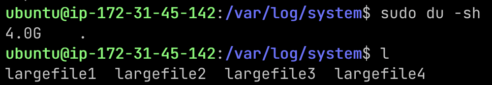

## 驗屍報告

### 遇到的問題和除錯步驟
1. syntax error

    首先我看到 `curl localhost`、`sudo systemctl start nginx` 時出錯

    
     
    

    因此我用`sudo nginx -t` 檢查 nginx 設定檔是否有問題？ 

    

    檢查後發現 `nginx.conf` 有 syntax error，將其修正。

    
2. port 80 被佔用

    修正完 syntax err 後，執行 `sudo systemctl start nginx` 、 `sudo systemctl status nginx` 仍會報錯

    

    錯誤訊息 ` bind() to 0.0.0.0:80 failed (98: Address already in use) ` ，表示 port 80 被佔用了。
    
    使用 `sudo lsof -i :80` 查看佔用 port 80 的 process ，將其 kill，並 disable ，以防止它在系統重啟時再次佔用 port 80。

    (下圖是我課後自己重做一遍的截圖，因此 ip 和其他截圖不同)

    

3. 防火牆

    此時可成功啟動 nginx 了，但 `curl localhost` 時卻連不上。

    

    問 ChatGPT 後，得知可能是防火牆的問題，因此用 `iptables -L` 來檢查防火牆。
    發現有一條設定 REJECT 了對 http (port 80) 的連接，並將此設定移除。

    可用 `sudo iptables-save > /etc/iptables/rules.v4` 儲存防火牆設定。避免機器重啟後 port 80 的連線又被 REJECT。

    (圖中 `sudo iptables -A INPUT -p top --dport 80
-j ACCEPT` 可不必執行)

    

4. 權限問題

    解決防火牆問題後，curl localhost 卻顯示 403 Forbidden。

    

    從 403 Forbidden 猜想可能是權限的問題。
    查看設定檔 `/etc/nginx/sites-enabled/default` ，發現其中有指定 `root /var/myweb`，接著查看 `/var/myweb/` 的權限，並更改至 644，即可成功 `curl localhost`。

    
    
5. 硬碟爆炸

    

    查看 log 檔是否佔用大量空間

    
     
    

    到 `/var/log/system` 刪除不必要的檔案

    
    

### 感想
這次的體驗很有趣！我覺得有這樣一個練習 troubleshooting 的機會很難得、收穫也很多。

與同學交流的過程，可以學習別人是怎麼從錯誤訊息中找出問題的。自己找出問題的原因時，與同學分享解法的過程也很有成就感。

謝謝老師準備了這次的活動～